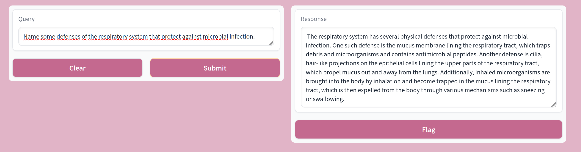

# RAG REPO

Experimental repository for building Retrieval-Augmented Generation (RAG) systems using LangChain. Testing different LLMs and document processing approaches for intelligent question answering.



## 🧠 Overview

This project experiments with RAG architecture that combines document retrieval with language models for contextual question answering. The system processes PDF documents, creates semantic embeddings, and provides answers based on document content.

### Experimental Setup
- **Document Processing**: PDF extraction and chunking with LangChain
- **Embeddings**: HuggingFace sentence transformers for semantic search
- **LLM Testing**: Experimented with **Mistral 7B** and **Llama** models
- **Vector Store**: FAISS for efficient similarity search
- **Interface**: Gradio web UI for interactive testing

## 🚀 Quick Start

### Prerequisites
- Python 3.8+ (tested with 3.11.5)
- 4GB+ RAM recommended

### Installation
```bash
git clone <repository-url>
cd RAG-REPO
python -m venv venv
source venv/bin/activate  # Windows: venv\Scripts\activate
pip install -r requirements.txt
```

### Setup
1. Download your chosen LLM model to `data/model/`
2. Place PDF documents in `data/` directory
3. Run: `python main.py`

## 🔧 Usage

### Gradio Interface
```bash
python main.py
```
Launches web interface for interactive querying.

### Console Mode
Uncomment console code in `main.py` for terminal interaction.

### Custom Integration
```python
import dataprocessing, modelsetup

text_chunks = dataprocessing.load_and_process_data("data/")
qa = modelsetup.setup_model_and_components("model_path", text_chunks)
result = qa({'query': "Your question"})
```

## 📁 Project Structure
```
RAG-REPO/
├── main.py              # Gradio interface
├── dataprocessing.py    # PDF processing
├── modelsetup.py        # LLM configuration
├── requirements.txt     # Dependencies
└── data/               # Documents and models
    ├── *.pdf
    └── model/
```

## 🏗️ Architecture

The RAG system follows a standard retrieval-augmented pipeline:

1. **Document Ingestion**: PDFs are loaded and split into overlapping chunks
2. **Embedding Creation**: Text chunks converted to 384-dim vectors using sentence transformers
3. **Vector Storage**: FAISS index stores embeddings for fast similarity search
4. **Query Processing**: User questions are embedded and matched against document chunks
5. **Context Retrieval**: Top-k most similar chunks are retrieved as context
6. **Response Generation**: LLM generates answers using retrieved context + original query

```
PDF Documents → Text Chunks → Embeddings → FAISS Index
                                              ↓
User Query → Embedding → Similarity Search → Context → LLM → Answer
```

## 🎯 Experiments

- **LLM Comparison**: Tested Mistral 7B vs Llama models for response quality
- **Chunking Strategies**: Optimized text splitting (10K chars, 20 overlap)
- **Retrieval Methods**: FAISS similarity search with k=2 documents
- **Interface Options**: Both Gradio web UI and console interaction

## 🚧 Future Improvements (On Standby)

**Error Handling & Robustness**
- Add try/catch blocks for file loading failures
- Graceful model initialization error handling
- Input validation for queries and file paths

**Configuration & Flexibility**
- Move hardcoded parameters to `config.yaml`
- Runtime model switching (Mistral ↔ Llama ↔ Ollama)
- Configurable chunk sizes and overlap ratios
- Environment variable support for model paths

**Enhanced Features**
- Support multiple document formats (Word, TXT, Markdown)
- Batch document processing with progress bars
- Document metadata tracking and filtering
- Query history and response caching

**Performance & Monitoring**
- Add structured logging for debugging and performance tracking
- Memory usage optimization for large document sets
- Response time metrics and quality scoring

## 📚 Resources
- [Mistral 7B Model](https://huggingface.co/TheBloke/Mistral-7B-Instruct-v0.1-GGUF)
- [LangChain Documentation](https://docs.langchain.com/)
- [Ollama](https://ollama.ai/) (alternative LLM runner)
